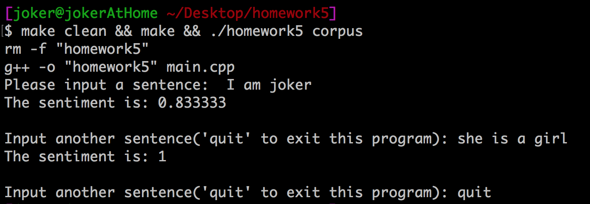
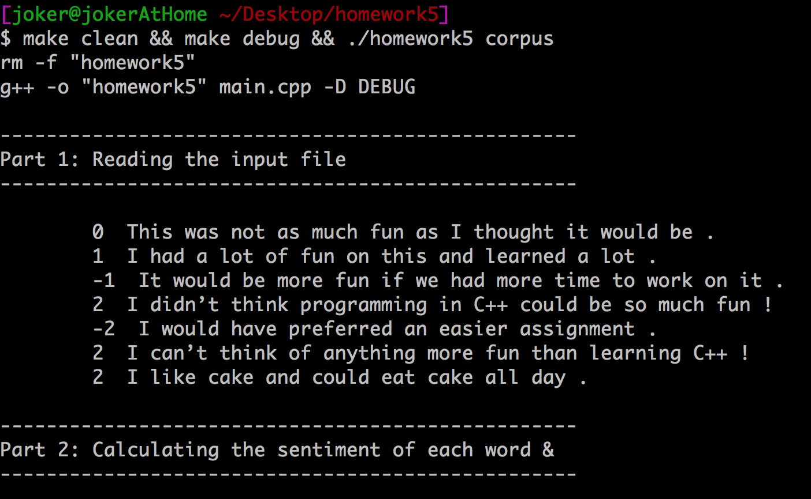

# compile and run with test data file

- `corpus`是输入文件的路径, 可换成其它输入文件路径，文件格式参考[PDF](homework5.pdf)中的描述
-  生成的执行文件名为`homeword5`
- `make clean && make debug`会生成带有调试输出的执行文件

## Release

```
$ make clean && make && ./homework5 corpus

```



## Debug

```
$ make clean && make debug && ./homework5 corpus
```


